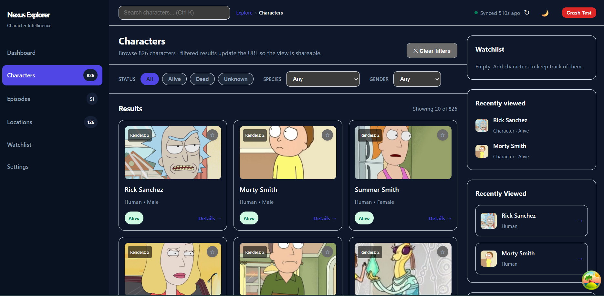
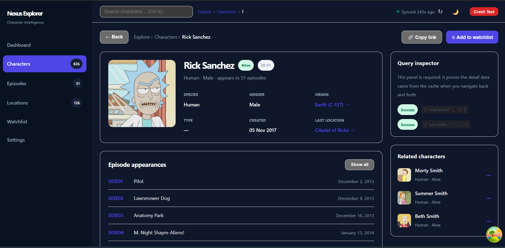
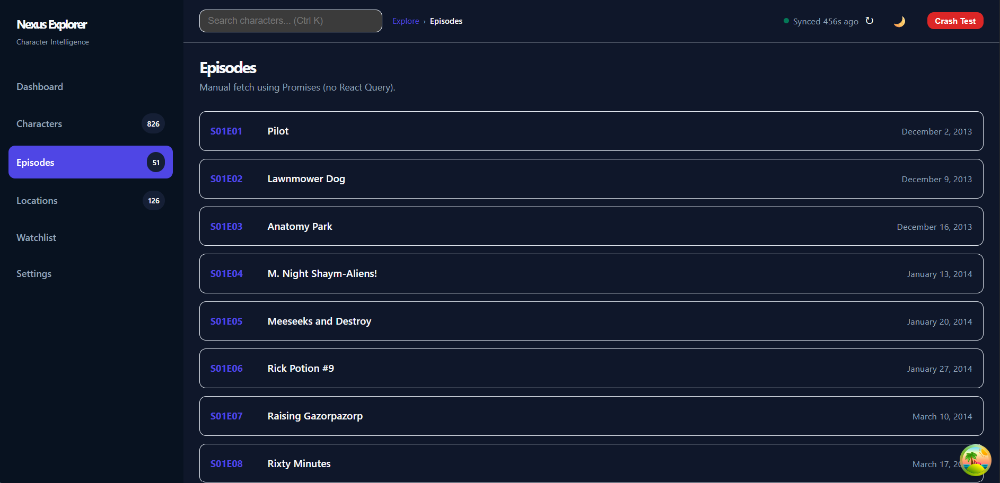

# Nexus Explorer 🌌

Nexus Explorer is an internal research console used by a small media-analytics team. It browses a large public character database ([The Rick and Morty API](https://rickandmortyapi.com/documentation)), keeps a personal watchlist, and features instant navigation powered by an advanced caching strategy.

Built for **OSTAD Full Stack Web Development with Django and React Batch-9 · Module-27** — Hooks · React Router DOM · Context API · TanStack React Query. Read-only demo — no backend, no database, no create/update/delete.

---

## Screenshots

| Characters | Character Detail | Episodes |
|---|---|---|
|  |  |  |

---

## Live Demo

[Visit here to see it live](https://ostad-django-m27-assignment.vercel.app)

---

## Setup Instructions

```bash
# 1. Clone the repository
git clone https://github.com/wasifibnharun/ostad-django-m27-assignment.git

# 2. Navigate to the folder
cd ostad-django-m27-assignment

# 3. Install dependencies
npm install

# 4. Start the development server
npm run dev
```

Then open your browser to `http://localhost:5173`.

**Other scripts:**

```bash
npm run build     # production build
npm run preview   # preview the production build
```

No environment variables or API keys are required — the app calls the public, CORS-enabled Rick and Morty API directly from the browser.

---

## Folder Structure

```text
src/
├── api/             # API constants and URL builders (endpoints.js, http.js)
├── app/             # Router config, QueryClient, and AppProviders
├── components/
│   ├── layout/      # AppShell, Sidebar, Topbar, Breadcrumbs
│   ├── ui/          # Card, Button, Badge, Chip, Skeleton, EmptyState, ErrorState, Pagination
│   ├── stats/       # StatGrid, StatCard
│   ├── characters/  # CharacterGrid, CharacterCard, CharacterFilters
│   ├── watchlist/   # WatchlistPanel, WatchlistButton
│   └── error/       # ErrorBoundary, FallbackUI, CrashTest
├── contexts/
│   ├── theme/       # ThemeContext, ThemeProvider, useTheme
│   └── watchlist/   # WatchlistContext (state + actions), WatchlistProvider, useWatchlist
├── hooks/           # useCharacters, useCharacter, useDebouncedValue, useRenderCount, usePrevious, useExpensiveCache
├── pages/           # DashboardPage, CharacterListPage, CharacterDetailPage, EpisodeListPage, LocationListPage, WatchlistPage, ComparePage, SettingsPage, NotFoundPage
├── utils/           # logger.js, format.js, statusToken.js
├── App.jsx
├── main.jsx
└── index.css
```

---

## Features

- **Live Summary Counters** — Real-time character, episode, and location counts, all derived from API `info.count`, never hard-coded.
- **Advanced Pagination & Filtering** — Search by name, status, species, and gender, fully synchronized with the URL (`useSearchParams`).
- **Instant Navigation** — Data prefetching on card hover and Prev/Next hover guarantees instant page transitions.
- **Persistent Client State** — Light/Dark theme and Watchlist saved to `localStorage`.
- **Robust Error Handling** — Granular error boundaries plus global `window.onerror` / `unhandledrejection` catchers prevent blank screens.
- **Responsive Design** — Adapts fluidly from desktop to mobile via a collapsible sidebar and dynamic grid.
- **Dual Fetching Strategies** — TanStack React Query for characters vs. hand-rolled `useEffect` + Promises/async-await for episodes and locations, for direct comparison.

---

## State Placement Architecture — REQ-17

A deliberate decision was made about where each piece of state lives, to keep the app shareable and performant.

| State Piece | Where It Lives | Why |
|---|---|---|
| Filters & Pagination | URL (`useSearchParams`) | Lets users bookmark or share exact search results; keeps the list page stateless. |
| Character ID (Detail) | URL (`useParams`) | The detail page can be refreshed or linked directly without depending on prior component state. |
| Watchlist IDs & Theme | Context + `localStorage` | Global values needed across disjointed components (Sidebar, Cards, Topbar); persistent across sessions. |
| API Data (Characters, etc.) | React Query cache | Server state — enables instant prefetching, background refetching, and request deduping. |
| Search Debounce Timer | `useRef` | Must survive re-renders without triggering them. |
| Recently Viewed | Local component state / ref | Specific to the current browsing session on the dashboard; doesn't need URL persistence. |

---

## Context Performance Optimization — REQ-16

When implementing the Watchlist Context, a naive approach was tested first: a single object containing both state (`watchlistIds`) and actions (`addToWatchlist`, etc.) passed into one Provider.

**Before (naive version):** Toggling one character card caused **20 re-renders** on the page. Every component consuming the context re-rendered, because the inline object `value={{ ids, actions }}` generated a new reference identity on every render.

**After (optimized version):** By splitting the context into `WatchlistStateContext` and `WatchlistActionsContext`, memoizing the value arrays with `useMemo`, wrapping every action in `useCallback`, and wrapping the card component in `React.memo`, toggling a card now causes exactly **1 re-render** — only the card being updated.

---

## React Query vs `useEffect` + `fetch` (Comparison)

This project implements data fetching two ways — TanStack React Query for Characters, and manual `useEffect` + `fetch` for Episodes and Locations — to compare developer experience and performance.

| Feature | React Query | `useEffect` + `fetch` |
|---|---|---|
| Caching | Automatic (`staleTime`, `gcTime`) | Manual caching mechanism needed (or none at all) |
| Duplicate Requests | Automatically deduped in-flight | Requires complex flag tracking to prevent duplicates |
| Loading/Error States | Provides `isLoading`, `isError`, `error` automatically | Requires explicit `useState` flags for loading and errors |
| Background Refetching | Built-in (`refetchOnWindowFocus`, etc.) | Requires manual event listeners on `window` |
| Request Cancellation | Handled natively (aborts outdated queries) | Requires manual `AbortController` setup and cleanup |
| Prefetching | One-liner: `queryClient.prefetchQuery` | Complicated to implement without polluting component logic |
| Lines of Code | ~10 lines per query | ~30–40 lines of boilerplate for a robust implementation |

**Conclusion:** React Query is far superior for server state — it eliminates massive amounts of boilerplate and handles edge cases gracefully. That said, plain `useEffect` + `fetch` is still the right call for a small, single-page script with only one API call, where pulling in a heavy third-party caching library would unnecessarily bloat the bundle size.

---

## Error Handling Strategy

React's `<ErrorBoundary>` is powerful, but not enough on its own — it only catches errors during the render phase, lifecycle methods, or inside `useEffect`.

**It does *not* catch:**
- Event handlers (e.g., a crash inside an `onClick`)
- Asynchronous code (e.g., `setTimeout` or a rejected `fetch` Promise)
- Errors thrown outside of React (e.g., in a standalone utility file)

**To stay resilient, this project uses:**
1. A React `ErrorBoundary` wrapping the whole `<App />`, and a second one wrapping the Characters panel individually.
2. Global `window.onerror` and `window.addEventListener('unhandledrejection', ...)` listeners registered in `main.jsx` to catch everything outside the React tree, routing all of it to a centralized logger.

---

## Router Mode Configuration — REQ-11

The app supports both `BrowserRouter` and `HashRouter`, toggled via the `VITE_ROUTER_MODE` environment variable.

- **BrowserRouter** — clean URLs (e.g. `/characters/1`). Requires backend/server configuration to redirect all traffic to `index.html`.
- **HashRouter** — URL hash-based (e.g. `/#/characters/1`). Ideal for static hosts like GitHub Pages, where the server can't be configured to rewrite routes, preventing 404s on direct navigation.

---

## React Concepts Used (Requirements Mapping)

| Req | Description | File | Line # |
|---|---|---|---|
| REQ-1 | `useRef` to touch the DOM | `src/components/layout/Topbar.jsx` | Line 62, 76, 86 |
| REQ-2 | `useRef` as a persisted mutable value | `src/hooks/useRenderCount.js` | Line 3 |
| REQ-3 | `useRef` for an expensive computation cache | `src/hooks/useExpensiveCache.js` | Line 3 |
| REQ-4 | Immutable updates (object/array) | `src/contexts/watchlist/WatchlistProvider.jsx` | Line 29 |
| REQ-5 | Controlled inputs / managed forms | `src/components/characters/CharacterFilters.jsx` | Line 6 |
| REQ-6 | `useEffect` with cleanups | `src/components/layout/Topbar.jsx` | Line 57, 71 |
| REQ-7 | Promises: `.then` / `.catch` / `.finally` | `src/pages/EpisodeListPage.jsx` | Line 24 |
| REQ-8 | `async`/`await` + `AbortController` | `src/pages/LocationListPage.jsx` | Line 15 |
| REQ-9 | Router setup, Layout, 404 | `src/app/Router.jsx` | Line 17, 36 |
| REQ-10 | `Link`, `NavLink`, `isActive` styling | `src/components/layout/Sidebar.jsx` | Line 54 |
| REQ-11 | Router Mode comparison | `README.md` | — |
| REQ-12 | Passing parameters via navigation | `src/pages/CharacterDetailPage.jsx` | Line 13, 16, 137 |
| REQ-13 | Context for low-frequency global values | `src/contexts/theme/ThemeContext.jsx` | Line 3 |
| REQ-14 | Split Context (State & Actions) | `src/contexts/watchlist/WatchlistContext.jsx` | Line 3 |
| REQ-15 | Modular context with boundary hooks | `src/contexts/theme/useTheme.js` | Line 4 |
| REQ-16 | Context performance pitfall fix | `src/components/characters/CharacterCard.jsx` | Line 12, 56 |
| REQ-17 | State placement architectural decision | `src/hooks/useRecentlyViewed.js` | Line 3 |
| REQ-18 | React Query client & Devtools | `src/app/queryClient.js` | Line 3 |
| REQ-19 | Query loading/error/empty handling | `src/pages/CharacterListPage.jsx` | Line 26 |
| REQ-20 | Cache configuration & background sync | `src/pages/SettingsPage.jsx` | Line 25, 41 |
| REQ-21 | Prefetching on hover | `src/components/stats/Pagination.jsx` | Line 14 |
| REQ-22 | Error boundaries & global logger | `src/components/error/ErrorBoundary.jsx` | Line 4, 16 |

---

## Tech Stack

- **Frontend:** React + Vite
- **Routing:** React Router DOM (`BrowserRouter` / `HashRouter`)
- **Server State:** TanStack React Query (+ Devtools)
- **Client State:** Context API (Theme, Watchlist) + `localStorage`
- **Data Source:** [Rick and Morty API](https://rickandmortyapi.com/api) — free, no key required, CORS-enabled

---

## License

This project was built for educational purposes as part of the OSTAD Django Batch-9 course. Data courtesy of [rickandmortyapi.com](https://rickandmortyapi.com).